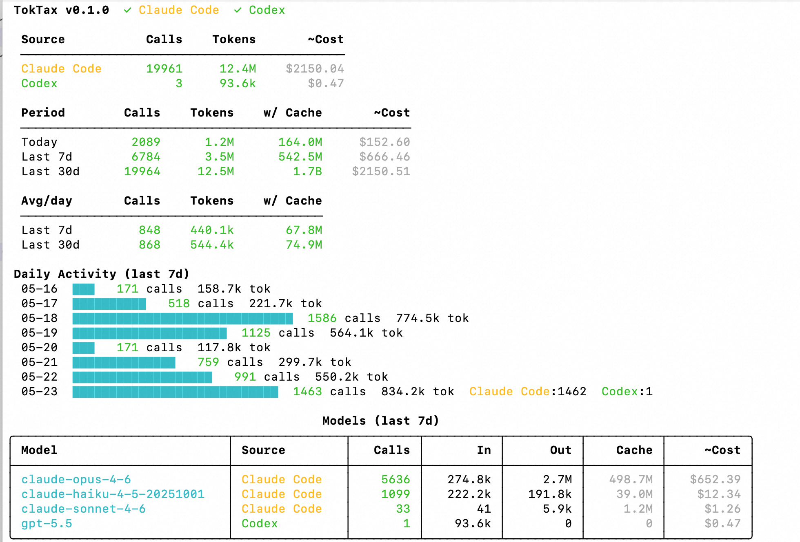

# TokTax

**One command to see your AI coding agent costs — zero config.**



## Quick Start

```bash
npx toktax
```

## Supported Tools

| Tool | Data Source |
| ---- | ---------- |
| [Claude Code](https://github.com/anthropics/claude-code) | `~/.claude/projects/**/*.jsonl` |
| [Codex CLI](https://github.com/openai/codex) | `~/.codex/state_5.sqlite` |

All data is read locally. Nothing is sent anywhere.

## License

MIT

---

[中文文档](README_CN.md)
